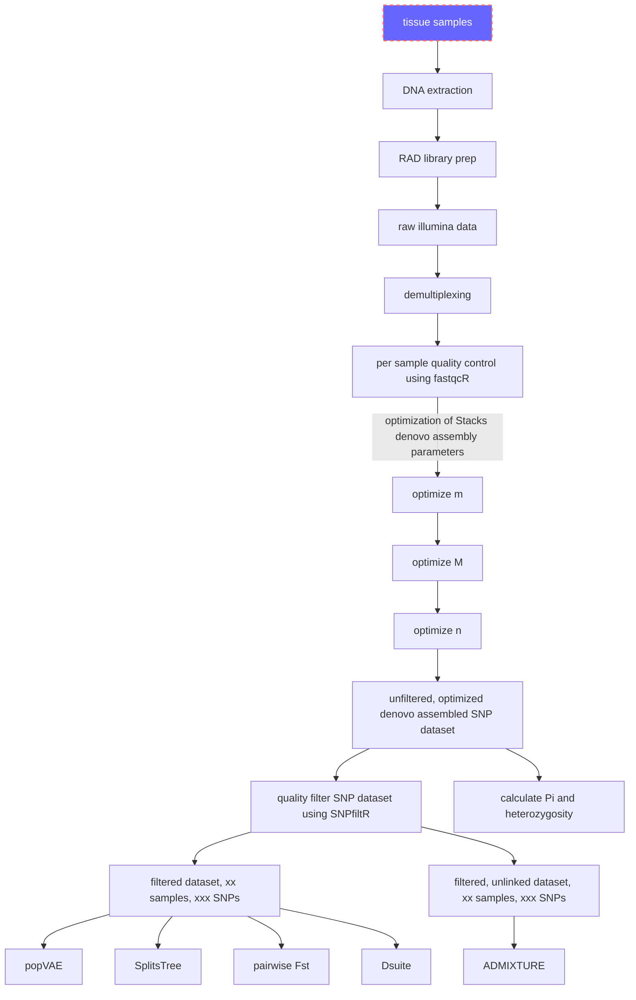

# chalc.rad

## Flowchart of analyses done for this paper (click on each box to see details)

https://devonderaad.github.io/chalc.rad/chalc.investigate.missing.data.html

https://devonderaad.github.io/chalc.rad/chalc.investigate.pop.struc.html
